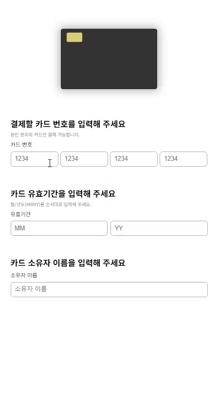
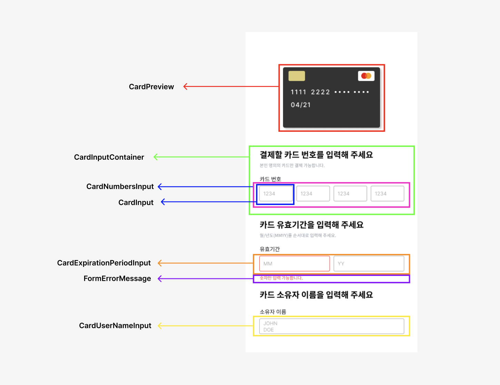

# 💳 react-payments

## 배포

[🌟스토리북 페이지 바로가기](https://6620c65c99e8a4a3cde004a4-cumpnlibwt.chromatic.com/)

[🌟배포 페이지 바로가기](https://badahertz52.github.io/react-payments/dist/)

## 구현

### step1

#### 구현 모습



#### 레이아웃 with 컴포넌트

**1단계**


### step2

#### 구현 모습


#### 레이아웃


## 빌드 및 스토리북 테스트

### 빌드

```dash
npm run build
```

### 로컬 서버로 열기

```dash
npm run dev
```

### 스토리북 테스트

```dash
npm run storybook
```

## 기능 구현 목록

 <details>
  <summary> ✏️ 1단계 기능 구현 목록</summary>
  <div markdown="1">

### 카드 번호

- [x] 입력란에 카드 번호 입력
- [x] 입력값에 대한 유효성 검사
  - 유효성 검사
    - 16자리 (하나의 input에 4개의 숫자)
    - type: 0-9 정수
- [x] 유효성 검사 fail 시, 오류 메세지 보여줌
- [x] 유효성 검사 통과 시 카드 구별
  - 4로 시작 visa, 51~55로 시작하면 마스터카드, 그 외는 기타
- [x] 카드 상태 업데이트

### 유효기간

- [x] 입력란에 월/연도 번호 입력
- [x] 입력란에 대한 유효성 검사
  - 유효성 검사
    - 월에 대한 입력값: 01-12
    - 연도에 대한 입력값: 정수 2자리
    - 사용 가능한 카드 유효 기간 : 이번달부터 인것만 유효하게
- [x] 유효성 검사 fail 시, 오류 메세지 보여줌
- [x] 유효성 검사 통과 시 카드 상태 업데이트

### 소유자 이름

- [x] 입력란에 이름 입력
- [x] 입력란에 대한 유효성 검사
  - 유효성 검사
    - 영어 소문자/대문자, 공백
    - 최소 1자 최대 100자
- [x] 유효성 검사 fail 시, 오류 메세지 보여줌
- [x] 유효성 통과 시, 소문자는 대문자로 변경 후 카드 상태 업데이트
  </div>
</details>

<details>
  <summary> ✏️ 2단계 기능 구현 목록</summary>
  <div markdown="1">

### 입력 필드

- [x] 카드 정보 필드 동적 구현: 카드 정보 입력 과정에 따라 컴포넌트 순차적으로 보여준다
  - [x] 필드 오픈 후, 이전 단계 필드에 대한 수정이 이루어져도 오픈된 필드 상태를 유지한다.

### 카드 선택

- [x] 카드사 선택 :카드 회사에 따라 카드 색, 정보 변경한다.
- [x] 카드사 select 선택 후, 옵션 선택이 이루어지지 않으면 오류 메세지를 보여준다.

### cvg 번호 입력

- [x] 카드 뒷면 보여준다.
- [x] 3자리 숫자만 입력 가능하다.
- [x] 유효하지 않으면 오류 메세지 보여준다.

### 비밀번호

- [x] 2자리 숫자가 아닐 경우 오류 메세지를 보여준다.

### 폼

- [x] 카드 정보가 유효하면 (submit ) 확인 버튼이 화면에 나타나고 활성화 된다
- [x] 사용자가 카드 정보 수정 시, 오류가 나면 확인 버튼을 감춘다.

### 카드 등록 완료 및 네비게이션

- [x] react-router 사용해 등록 페이지와 등록 완표 페이지를 구성한다.
- [x] 등록 시 카드 등록 완료 페이지로 이동한다.
  - 등록 완표 페이지로 이동하기 전에 등록 페이지의 form을 초기화한다.
- [x] 등록 완표 페이지에는 카드 번호, 카드사 포함된 메세지와 확인 버튼을 보여준다.
- [x] 등록 완료 페이지에서 확인 버튼 클릭 시 다시 등록 페이지로 이동한다.

  - cardInfo는 초기화 된다.

    </div>
  </details>

## 폴더 및 파일 구조

| 폴더       | 설명                                                              |
| ---------- | ----------------------------------------------------------------- |
| assets     | 사진등 관리                                                       |
| components | 컴포넌트 (해당 컴포넌트와 이에 대한 스타일, hook을 관리)          |
| constants  | 주요 상수 관리                                                    |
| hooks      | 커스텀 훅 관리(단, 전역 상태에 대한 커스텀 훅은 modules에서 관리) |
| modules    | 전역 상태 관리                                                    |
| pages      | 페이지 관리                                                       |
| stories    | 스토리북                                                          |
| styles     | 컴포넌트외의 스타일 관리                                          |
| utils      | 유틸함수 관리                                                     |

<br/>
<details>
  <summary> 🗂️ 컴포넌트  파일 구조 보기</summary>
  <div markdown="1">
  
```
📦components
 ┣ 📂CardBackImg
 ┃ ┣ 📜index.tsx
 ┃ ┗ 📜style.module.css
 ┣ 📂CardCompanySelect
 ┃ ┗ 📜index.tsx
 ┣ 📂CardCVCInput
 ┃ ┣ 📜index.tsx
 ┃ ┗ 📜style.module.css
 ┣ 📂CardExpirationPeriodInput
 ┃ ┣ 📜index.tsx
 ┃ ┗ 📜style.module.css
 ┣ 📂CardForm
 ┃ ┣ 📜index.tsx
 ┃ ┗ 📜style.module.css
 ┣ 📂CardFrontImg
 ┃ ┣ 📜index.tsx
 ┃ ┗ 📜style.module.css
 ┣ 📂CardInputSection
 ┃ ┣ 📜index.tsx
 ┃ ┗ 📜style.module.css
 ┣ 📂CardNumbersInput
 ┃ ┣ 📜index.tsx
 ┃ ┗ 📜style.module.css
 ┣ 📂CardPasswordInput
 ┃ ┣ 📜index.tsx
 ┃ ┗ 📜style.module.css
 ┣ 📂CardPreview
 ┃ ┣ 📜index.tsx
 ┃ ┗ 📜style.module.css
 ┣ 📂CardUserNameInput
 ┃ ┣ 📜index.tsx
 ┃ ┗ 📜style.module.css
 ┣ 📂ErrorMessage
 ┃ ┣ 📜index.tsx
 ┃ ┗ 📜style.module.css
 ┣ 📂Input
 ┃ ┣ 📜index.tsx
 ┃ ┗ 📜style.module.css
 ┣ 📂Layout
 ┃ ┣ 📜index.tsx
 ┃ ┗ 📜style.module.css
 ┣ 📂Select
 ┃ ┣ 📜index.tsx
 ┃ ┗ 📜style.module.css
 ┗ 📜index.ts
```
  
  </div>
</details>

<details>
  <summary>🗂️ 페이지 파일 구조 보기</summary>
  <div markdown="1">
  
```
📦pages
 ┣ 📂CardEnrollmentConfirmation
 ┃ ┣ 📜index.tsx
 ┃ ┗ 📜style.module.css
 ┣ 📂CardEnrollmentPage
 ┃ ┗ 📜index.tsx
 ┣ 📂Home
 ┃ ┣ 📜index.tsx
 ┃ ┗ 📜style.module.css
 ┗ 📜index.tsx
```
  
  </div>
</details>
