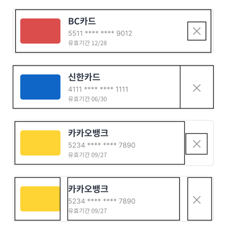
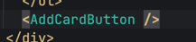
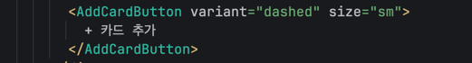
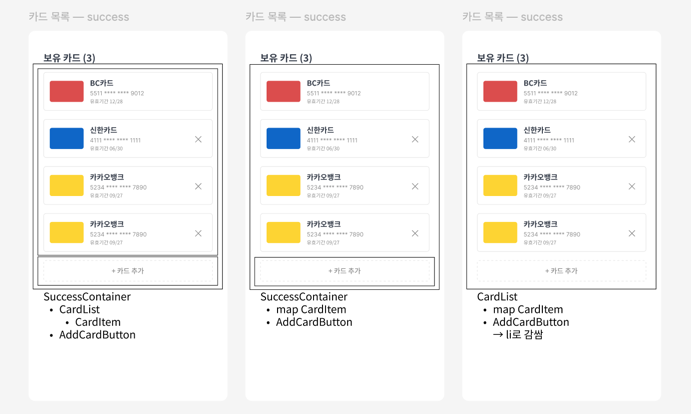

1. button 안에 button -> absolute로 중첩 vs 좌우 영역 구분
    1. absolute로 중첨: 전체 영역을 button으로 관리할 수 있음 (레이아웃으로부터 자유로움) / 레이아웃에 예외를 두는 거라 유지보수성은 떨어짐
    2. 좌우 영역 구분: 전체 영역을 button으로 관리하기 어려움 (빈 공간이 생기거나, 사용자는 카드 item 클릭이라고 생각했는데 삭제 클릭이 될 가능성) / 레이아웃 유지 가능

   

2. AddCardButton의 variant, size를 어떻게 관리할까? 별도의 토큰 생성 vs Button의 토큰을 그대로 주입
    1. 별도의 토큰 생성: 더 선언적 + SubmitButton과 동일한 방식으로 추상화 가능 / 다른 조합이 생겼을 때 토큰을 계속 추가해야 함
    2. Button 토큰 그대로 주입: 다양한 조합에 유연하게 대응 가능 / 불필요한 정보 노출인가? 싶기도 + SubmitButton과 추상화 레벨이 다름

      
   

3. card item 안에서 li로 묶기 vs 외부에서 li로 감싸기
    1. card item에서 li로 묶기: ul/ol 안에서만 써야 함 / list 요소라는 게 명확함
    2. 외부에서 li로 감싸기: list로 안 쓸 경우 card item의 범용성 올라감 / 사용하는 곳에서 태그가 하나 더 생김

4. success container 구조

    1. success container > ( card list > card item ) / add card button: 추상화 레벨 맞춤
    2. success container > ( map card item ) / add card button:
    3. card list > ( map card item ) / add card button: card list / card list error / card list empty / card list loading 등 조금 더 외부 요소들과 네이밍 맞추기 좋음,

       -> success / error / loading / empty 를 개별 컴포넌트로 나눌 필요가 있는가? 항상 section 단위로 같이 움직임

   

5. 페이지의 역할? 컴포넌트의 역할?
    1. 페이지는 컴포넌를 조합하기만 -> 페이지에 다른 기능이 추가되거나, 특정 기능을 담당하는 페이지가 변경되어도 기능 모듈 단위로 분리 가능
    2. card list section -> 카드 목록 조회에 대한 전체 흐름 제어 (loading, success, error, empty)

       -> card list section에 add card button이 있어야 하나?
       -> 아니면 페이지에서 card list section과 add card button을 조합해야 하나?
       -> api 응답 상태에 따라 add card button도 제어되어야 하니까 우선은 card list section에 같이 있어도 괜찮을 것 같다
